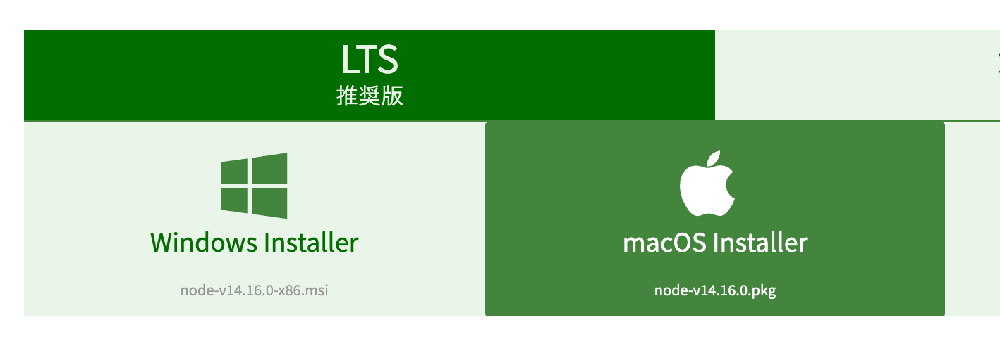
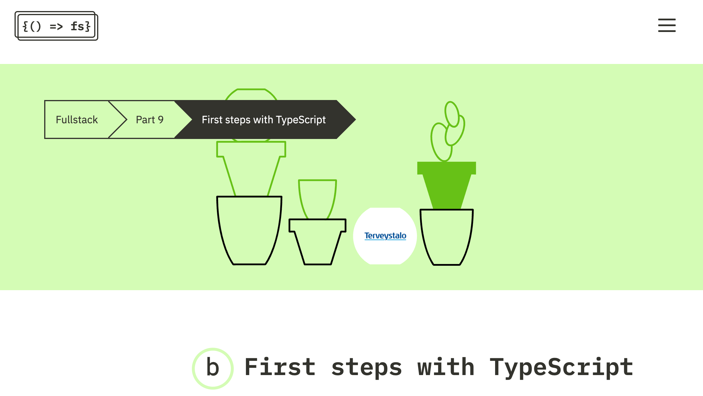

# 鹿児島.mk #16 TypeScript 体験会

イベントページ (connpass)
https://kagoshima-mk.connpass.com/event/207617/

## 事前準備

node が参加 PC にない人はインストールをお願いします

https://nodejs.org/ja/download/



確認するためのコマンド

```
$ node -v
v12.18.0
```

## 教材

型安全な計算機を作ります

https://fullstackopen.com/en/part9/first_steps_with_type_script




## カリキュラム

https://github.com/yoshikouki/ts_calculator/pulls?q=is%3Apr+is%3Aclosed


