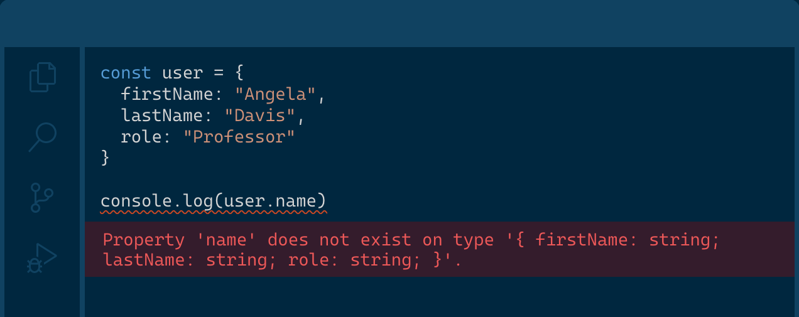

# 鹿児島.mk #16 TypeScript 体験会

イベントページ (connpass)
https://kagoshima-mk.connpass.com/event/207617/

## 事前準備

node.js が参加 PC にない人はインストールをお願いします

https://nodejs.org/ja/download/


node が入っているかどうかを確認するためのコマンド

```
$ node -v
v14.15.5
```

## 本日の流れ

1. 鹿児島.mk について (5分)
2. TypeScript について (15分)
3. ワークショップ (1時間)

## 1. 鹿児島.mk について

### 自己紹介


https://twitter.com/k2_yoshikouki

### 鹿児島.mk とは

「プログラミング初学者や初見のエンジニアでも気軽に参加できる」 がコンセプトのエンジニアコミュニティです。

https://kagoshima-mk.connpass.com/

## 2. TypeScript について



https://www.typescriptlang.org/


### TypeScript とは

JavaScript に静的型付けとクラスベースオブジェクト指向を加えたものです。型の恩恵によって強力な静的コード解析やエディタ支援機能があります。これによってコードを実行する前からエラーを教えてくれるので開発スピードの高速化が見込めます。

フロントエンド (クライアント)・サーバーサイドのどちらでも動きます。

マイクロソフトによって開発されており、様々な大規模サービスでの採用例があります。

### どんな感じの言語なのか

```TypeScript
interface Person {
  firstName: string;
  lastName: string;
}

function greeter(person: Person) {
  return `Hello, ${person.firstName} ${person.lastName}`;
  // return "Hello, " + person.firstName + " " + person.lastName;
}

const user = { firstName: "Jane", lastName: "User" };

document.body.textContent = greeter(user);

```

### TypeScript を採用するメリット

- 型による恩恵を得れる
    - 静的コード解析による事前のエラー検知
    - エディタ支援機能
    - 大人数の大規模な開発でも見通しを確保できる
- Web フロントエンドのデファクト・スタンダードとなっている JavaScript でサーバーサイドも開発できる
    - 言語の知見が流用できるので学習コストが減る

### TypeScript を採用するデメリット

- 型定義が面倒 (型定義は省略可能)
- コンパイルしないと実行できない

### どんな型があるのか


https://www.typescriptlang.org/docs/handbook/typescript-in-5-minutes-func.html#built-in-types

## 3. ワークショップ

### 教材

型安全な計算機を作ります

https://fullstackopen.com/en/part9/first_steps_with_type_script


### カリキュラム

https://github.com/yoshikouki/ts_calculator/pulls?q=is%3Apr+is%3Aclosed
